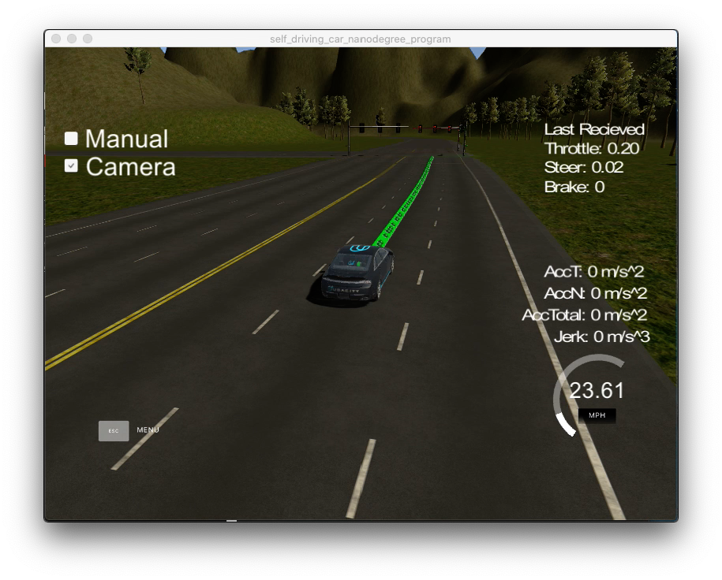
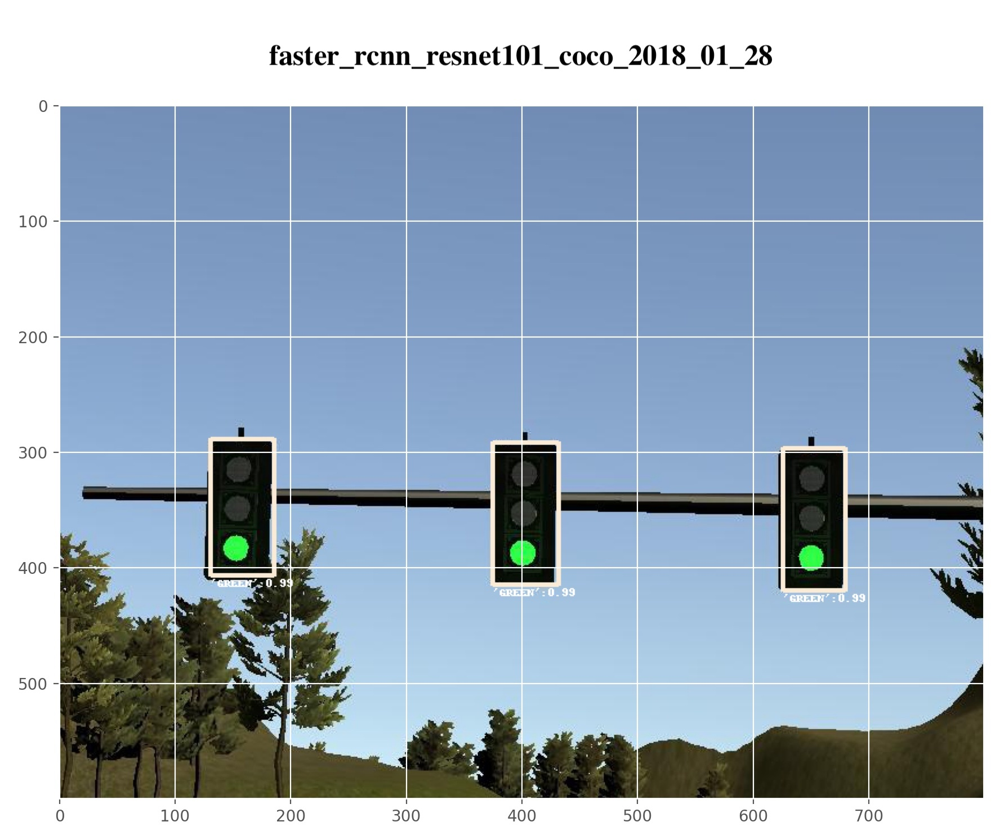
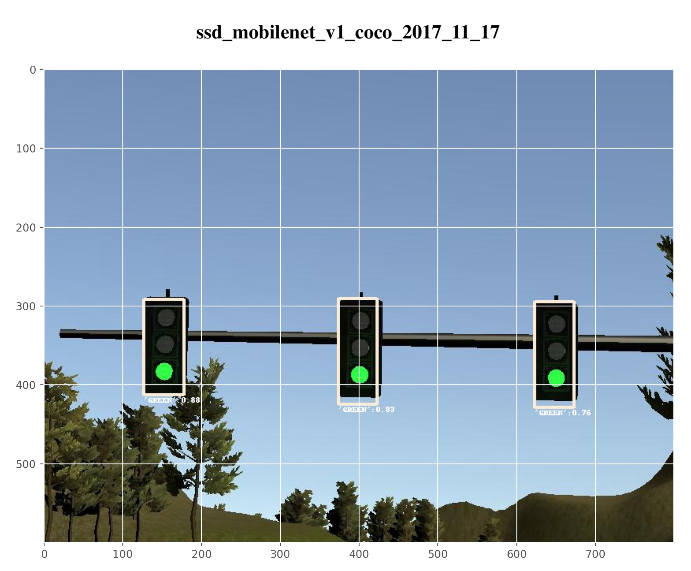
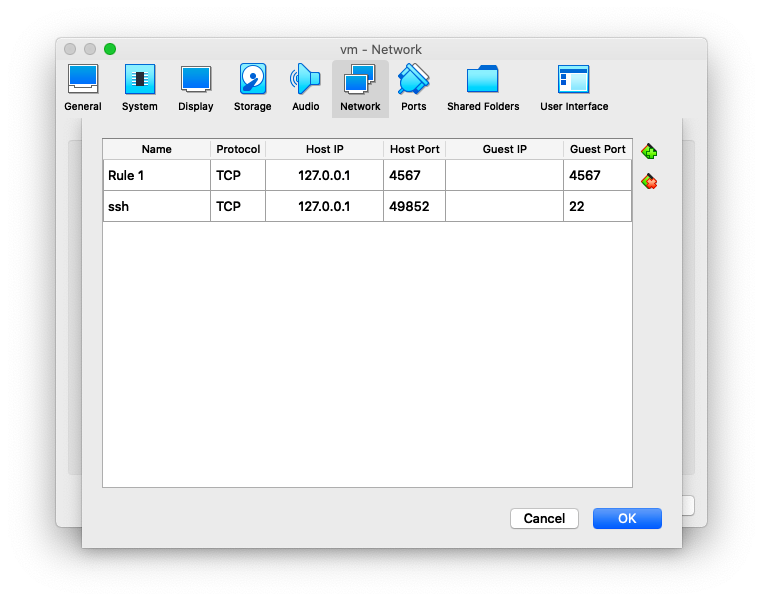

# ROS implementation of self driving car control software

This implementation establishes ROS nodes to drive a self-driving car around a simulated track. The only dynamic environmental factors considered by the car are traffic lights. An image classifier is used to determine the color of the upcoming light.



<br>


### Key ROS nodes
 1. tl_detector : detect and publish traffic light detection and color classification
 2. waypoint_updater : establishes path for car based on global waypoint set
 3. twist_controller : implements drive-by-wire PID controller for steering and speed

<br>

### Traffic light classifier
Several pretrained detection and classification models were used from the tensorflow object detection library. The version listed below was a commit compatible with the simulator's version of tensorflow --version 1.3.

https://github.com/tensorflow/models/tree/1f34fcafc1454e0d31ab4a6cc022102a54ac0f5b/research/object_detection

The models evaluated were "ssd_mobilenet_v1_coco_2017_11_17" and "faster_rcnn_resnet101_coco_2018_01_28" which can be downloaded from

```bash
wget http://download.tensorflow.org/models/object_detection/ssd_mobilenet_v1_coco_2017_11_17.tar.gz
wget http://download.tensorflow.org/models/object_detection/faster_rcnn_resnet101_coco_2018_01_28.tar.gz

```

The models were retrained on images captured through the simulator using tl_detector ROS node and the simulator's simulated camera. 200+ images were collected. The raw images were processed in the following way:
1. Objects were manually located and classified using labelImg (https://github.com/tzutalin/labelImg) to create an annotation *.yaml file.
2. Using TensorFlow's TFRecordWriter() script, *.record files were created for training.
3. Label mapping was established through the *.pbtxt file.
4. The pretrained model's *.config file was modified to specify the details of the re-training.
5. The model was re-trained using TensorFlow's object_detection/train.py code. e.g. 
```bash
python train.py  --logtostderr --train_dir=training/ --pipeline_config_path=training/ssd_mobilenet_v1_coco.config.config
```
6. The output from the last training checkpoint was used to create a file of frozen weights, e.g.
```
python export_inference_graph.py \
    --input_type=image_tensor \
    --pipeline_config_path=training/ssd_mobilenet_v1_coco.config \
    --trained_checkpoint_prefix=training_mn/300_300/model.ckpt-6113 \
    --output_directory=trained_models/trained_mn_model_6113/
```

The results produced pros and cons for each model. The faster_rcnn_resnet101 model was more accurate and more reliable, but the model file was 190 MB and took >15 s to classify on the simulator. Perhaps on a real system (with a GPU) this would not take so long. Regardless, this speed issue made faster_rcnn_resnet101 impractical for this project. The ssd_mobilenet model, on the otherhand, was less reliable (not as consistently accurate) but was only 20 MB in size and classified in <0.7 s. Ultimately I chose to go with the ssd_mobilenet.

An example of a test classification is shown below. The first is with faster_rcnn_resnet101 and the second is with ssd_mobilenet.




<br>

### Overall Approach
The approach implemented here represents a strategy using a provided waypoint list and creating trajectories based on selecting a subsection of that list. The waypoints are selected based on desired velocity, desired lane position, and traffic light conditions. A video showing the simulation (including selected waypoints and response to a traffic light) is given  in imgs/demo_tl_response.mov


<br>

---

## Conclusions
- The lag in the simulator made it difficult to evaluate the effectiveness of the stop light detector and classifier. As can be seen in the video, there is a significant lag between the light changing to green and the car begining its acceleration. Perhaps a better GPU would eliminate this issue.

- It was interesting to see first hand the tradeoffs between faster_rcnn_resnet101 and ssd_mobilenet. Again, with a stronger processor and GPU perhaps the more capable classifier would have provided a more robust solution--particulary important if this software was deployed on a real vehicle in a real environment. 


<br>

---

## Usage

This project was setup on a VM image using virtual box with ROS already installed. The following steps outline the setup


### Port Forwarding
To set up port forwarding.



1. Clone the project repository
```bash
git clone https://github.com/udacity/CarND-Capstone.git
```

2. Install python dependencies
```bash
cd CarND-Capstone
pip install -r requirements.txt
```
if python errors occur, run the following

```bash
sudo easy_install pip==20.02
pip install testresources
pip install setuptools==44.0.0
pip install -r requirements.txt
```
3. Make and run styx
```bash
cd ros
catkin_make
source devel/setup.sh
roslaunch launch/styx.launch
```

if catkin_make fails, copy the following
```bash
dbw_mkz_msgs
```
to 
```bash
ros/src/
```

4. Run the unity-based udacity simulator (on the host machine using port forwarding). The simulator can be found at 
```bash
https://github.com/udacity/CarND-Capstone/releases
```


